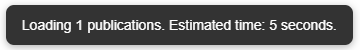

# Micro Academic Library

A FastAPI-based web application for downloading scientific publications from arXiv, extracting metadata using AI, storing them in SQLite, and browsing them through a simple web interface with pagination.

### Main interface


---

## Features

- Download scientific papers from arXiv
- Extract metadata (title, summary, tags, language, organization, country)
- Store and display publications in a local SQLite database
- Pagination (5/10/20/50 per page)
- Database statistics (number of saved publications)
- Polling API every 10 seconds to detect updates
- OpenAI-based metadata extraction

---

## Installation

1. Clone the repository:

```bash
git clone https://github.com/MemphisAton/micro-academic-library.git
cd micro-academic-library
```

2. Run the installer (creates virtual environment and installs dependencies):

```
install.bat
```

3. Create a `.env` file in the root of the project:

```
OPENAI_API_KEY=your-openai-api-key
```


4. Start the app:

```bash
uvicorn app.main:app --reload
```

5. Open in your browser:

```
http://127.0.0.1:8000
```

---

## Project structure

```
micro-academic-library/
├── app/
│   ├── main.py
│   ├── models.py
│   ├── crud.py
│   ├── schemas.py
│   ├── database.py
│   ├── views.py
│   ├── templates/
│   │   └── index.html
│   └── static/
│       ├── style.css
│       └── main.js
├── scripts/
│   ├── downloader_arxiv.py
│   └── extractor_ai.py
├── data/
│   └── library.db  (auto-generated)
├── .env
├── requirements.txt
└── README.md
```

---

## Configuration

- `limit`: how many new papers to add (only new ones will be saved, older skipped)
- Polling checks for new data every 10 seconds via `/publications/updated-since`
- All data is saved in `data/library.db` (SQLite)

---

## Dependencies

- Python 3.12+
- FastAPI
- Uvicorn
- SQLAlchemy
- Jinja2
- requests
- PyPDF2
- python-dotenv
- openai (optional)

---

## Notes

- If OpenAI is blocked in your region, you may see error 403 `unsupported_country_region_territory`
- If AI connection fails (e.g., no internet or bad API key), you will see an error message in the corner:

  

- During article loading, the system shows a non-blocking message like this:

  

- These popup messages automatically disappear after a few seconds and are used for both errors and progress feedback.

---


## Author

Developed by Anton Marusin (tg: [@MemphisAton](https://t.me/MemphisAton))